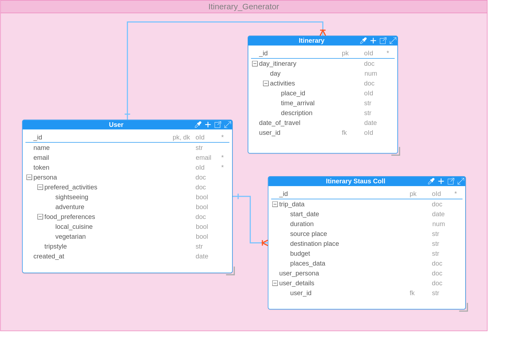

# [Travel Buddy]()


> Create beautiful itineraries with ease.

Travel Buddy is a powerful web application built with Next.js that helps users create personalized travel itineraries. Whether you're planning a weekend getaway or a week-long adventure, Travel Buddy streamlines the process of organizing your perfect trip.

## Features

- Streamlined Itinerary Creation
- Personalized place suggestions
- Day-wise planning
- Itineraries sent via email
- Beautiful User Interface
- Passwordless Authentication
- Building persona-based itineraries
- Duration and budget-wise customization
- Clean architecture
- Mailing service for instant notifications

## Flow Diagrams

### Frontend


### Backend


## DB Diagram



## System Architecture


## Tech Stack

- **MongoDB** - NoSQL database for storing data
- **Mongoose** - ODM
- **Next.js** - React framework for production
- **Tailwind CSS** - Utility-first CSS framework
- **TypeScript** - Superset of JavaScript for type safety
- **Node.js** - JavaScript runtime for server-side development
- **Express** - Web framework for Node.js
- **Puppeteer** - For generating PDFs
- **Nodemailer** - For sending emails
- **Render** - Deployment platform for backend services
- **Vercel** - Deployment platform for frontend
- **Flask** - Python framework for creating APIs
- **Pydantic** - Data validation in Python
- **Mistral AI Model** - For generating customized itineraries matching the user persona

## Tools Used

- **Geoapify** - For fetching places, routes, and place information
- **Picsum** - For generating images for the banner
- **Together AI** - For Mistral AI model API
- **React-Leaflet** - For displaying maps with OpenStreetMaps

## Deployment Platform

- **Render** - Backend deployment
- **Vercel** - Frontend deployment

## Deployed Links
  [Travel Buddy]()
  
## Solution Future Aspects

- Booking of hotels, flights from the website
- Fine-tuning the model to get more accurate results for creating the itineraries
- AI-driven recommendations that would help users create a more fine-tuned itinerary
- Social network where users would be able to share their itineraries with others and collaborate
- Real-time collaboration for form filling when planning group trips
- Transition from monolithic backend to a microservices architecture
- Create a separate service for notifications
- Implement caching and additional fallback mechanisms to handle edge cases

## Alternate Solutions

- A microservices architecture could improve scalability and maintainability.
- A dedicated notification service could enhance the robustness of the alert system.
- Consider using a serverless architecture for handling different services independently
- Explore other ML models or services for itinerary generation

## Reproducing API Keys

To reproduce the API keys and secrets, ensure that sensitive information is managed securely using environment variables. Include example values in `.env.example` files and avoid committing real keys to version control.

## Pros and Cons of Proposed Solution

### Pros
- Streamlined and user-friendly interface
- Persona-based, budget, and duration-wise itinerary customization
- Clean architecture with a fallback mechanism
- Immediate email notifications

### Cons
- Monolithic backend structure; could benefit from microservices
- Notification system could be more robust as a separate service
- Potential for improvements with caching and additional fallback mechanisms

## Getting Started

### Installation

1. Clone the repository:
   FIXME: Add GitHub URL here

    ```
    git clone https://github.com/TechyMT/aivelnirary.git
    ```

2. Navigate to the project directory:

    ```
    cd aivelnirary/frontend
    ```

3. Install dependencies:

    ```
    npm install
    ```

4. Create a `.env.local` file in the root directory and add your environment variables:

    ```
   NEXTAUTH_SECRET=your_auth_secret_here
   AUTH_GOOGLE_ID=your_google_id
   AUTH_GOOGLE_SECRET=your_google_secret
   NEXT_PUBLIC_BASE_URL=
   NEXT_PUBLIC_LIVEBLOCKS_SECRET=your_liveblocks_secret
   NEXT_PUBLIC_PEXELS_API_KEY=your_pexels_api_key
    ```

5. Run the development server:

    ```
    npm run dev
    ```

6. Open [http://localhost:3000](http://localhost:3000) in your browser to see the application.

### Running Backend and ML Server

1. Navigate to the backend directory and start the server:

    ```
    cd backend
    npm install
    npm run dev
    ```

2. Navigate to the ML server directory and start the server using Gunicorn:

    ```
    cd ml
    npm install
    gunicorn app:app --bind 0.0.0.0:8000
    ```

## Acknowledgments

- Thanks to all the open-source projects that made this possible.
- Inspired by travelers worldwide seeking easier trip planning solutions.

## Contact

For any inquiries or support, please email us at mustafatrunkwala8@gmail.com or open an issue in this repository.

Happy travels with Travel Buddy! 🌍✈️🏨
